# Hub Técnico - Busk Seguros


Bienvenido al **Hub Técnico de Busk Seguros**. Este portal centraliza toda la documentación técnica para el sistema automatizado de procesamiento de documentos.

## 🚀 Flujo Crítico de Procesamiento
Para entender cómo el sistema maneja los archivos desde el origen hasta la base de datos, consulta:
👉 **[Proceso FTP y Validación](ftp-val.md)**

---

## 📂 Navegación de Especificaciones
- **[Arquitectura](architecture.md)**: Componentes del sistema y diagramas de flujo.
- **[Firmas de API](api.md)**: Endpoints REST y contratos de datos.
- **[Base de Datos](database.md)**: Modelo ER y diccionario de datos de PostgreSQL.
- **[Catálogo de Productos](products.md)**: Estructura detallada de los **Anexos 1 al 5**.
- **[Lógica de Negocio](logic.md)**: Reglas de Stock, Inclusiones y Novedades.

> [!TIP]
> Utiliza la barra lateral para navegar o la búsqueda global para encontrar campos específicos de los anexos.


# Arquitectura de Infraestructura

Representación visual de los componentes del sistema y el ciclo de vida del procesamiento de documentos.

---

## 1. Modelos Visuales de Referencia
Para comprender rápidamente la magnitud y funcionamiento del sistema, revisa los modelos conceptuales aprobados:

### Modelo de Entidades (ERD)
Para claridad conceptual, a continuación las entidades core y sus relaciones principales en la base de datos:

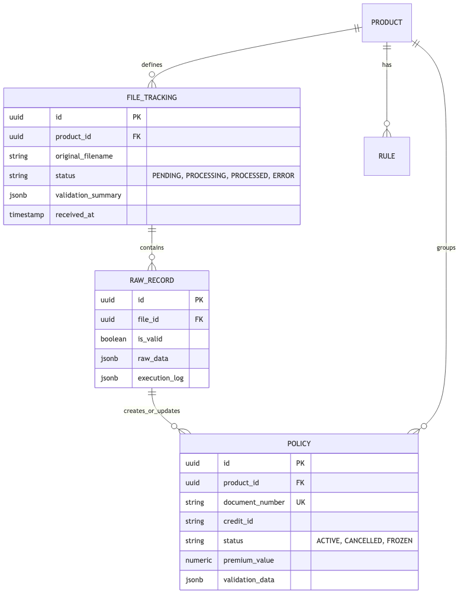

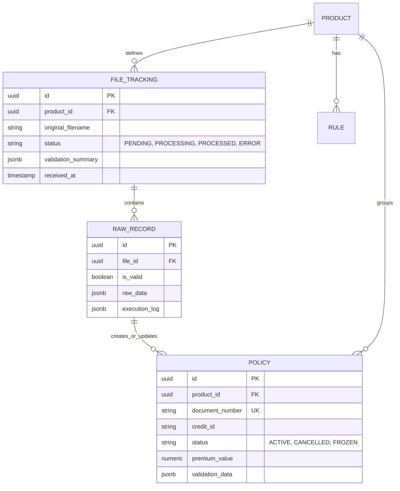

### Ciclo de Vida del Archivo (File Tracking)
Controla el estado operativo del procesamiento en bloque de un Anexo FTP.

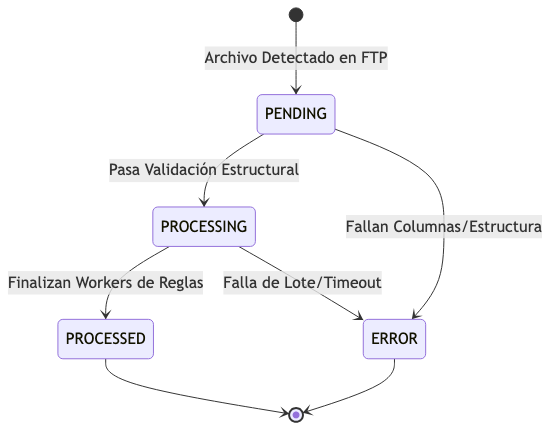

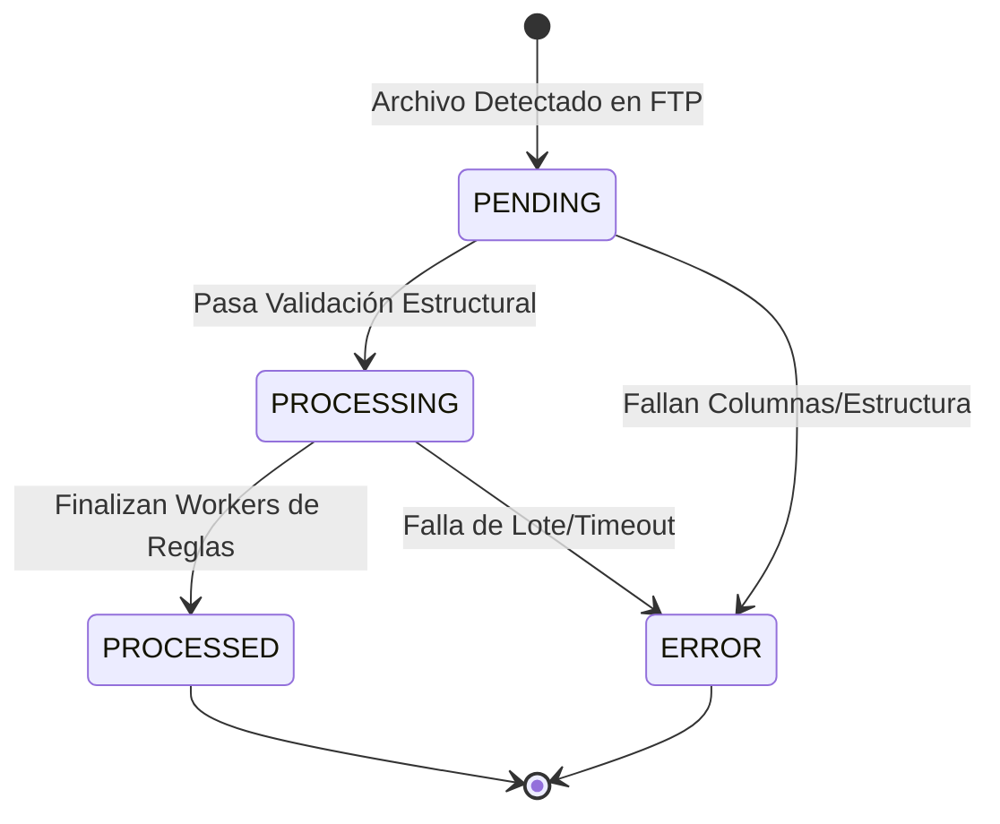

### Flujo de Estados de Póliza (Policy)
A nivel de fila única individual; el ciclo de vida de un asegurado/deudor a partir de las reglas asíncronas.

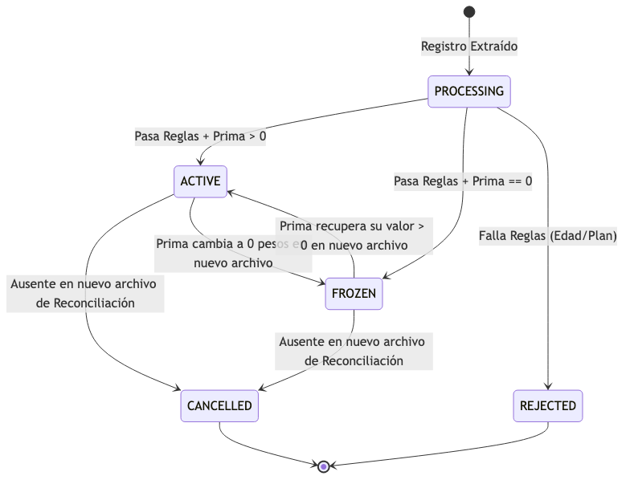

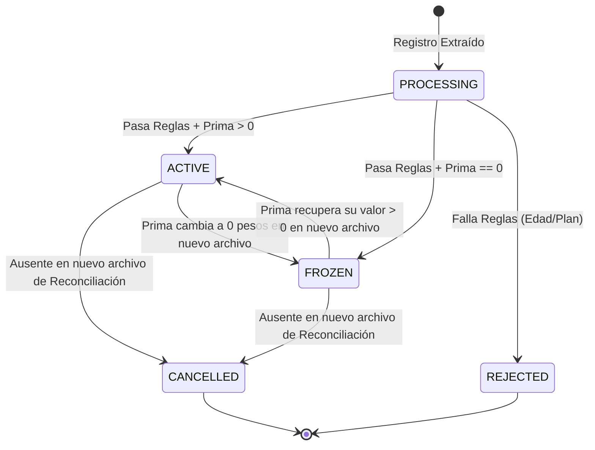

### Modelo de Componentes General (Estructura de Carpetas)
- `/api`: Endpoints REST Fiber/Gin.
- `/jobs`: Background Workers (FTP, Reconciliación).
- `/rules`: Motor de Validación Síncrono y Asíncrono.
- `/models`: Structs (Entidades) de la BD.

---

## 2. Arquitectura de Componentes (C4 Model)
El sistema está diseñado en Go (Golang) para alto rendimiento, interactuando con un servidor FTP externo y una base de datos PostgreSQL.

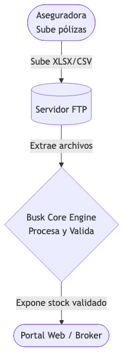

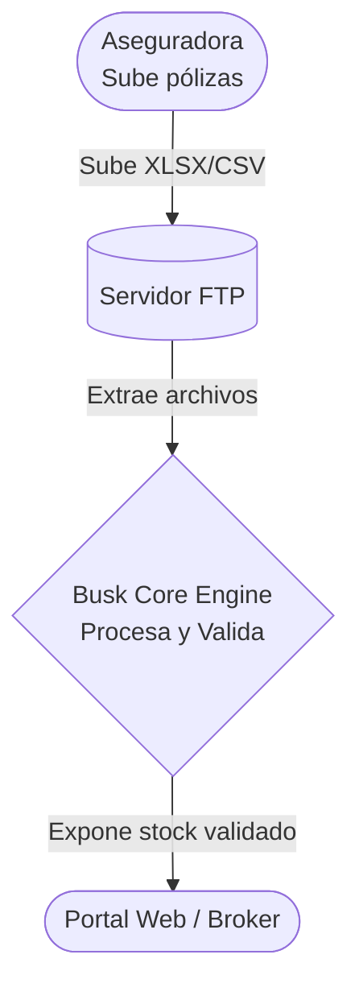

### Componentes Internos (Go)


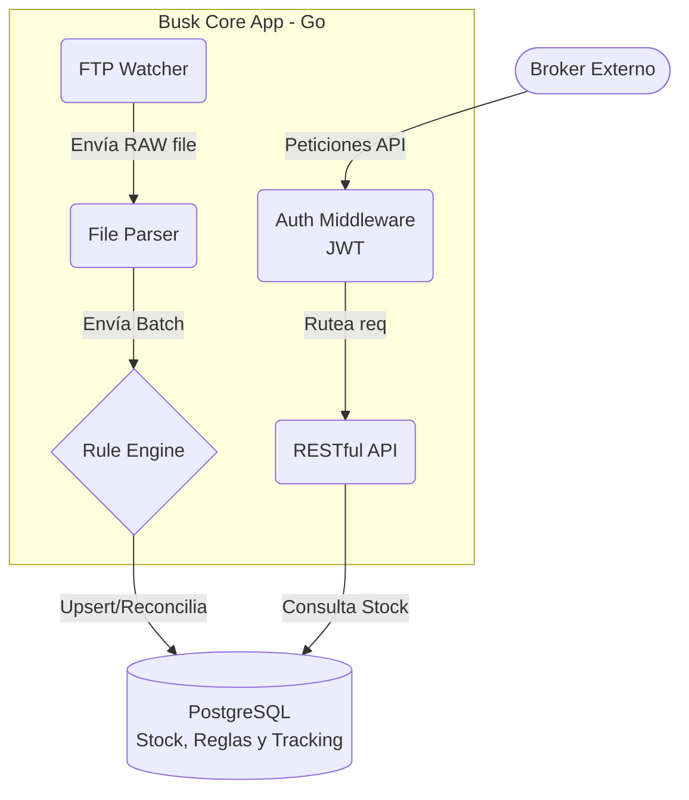

---

## 3. Flujo de Integración y Procesamiento (Secuencia)
El siguiente diagrama detalla la integración End-to-End desde que la aseguradora sube el archivo hasta que queda disponible en la API.

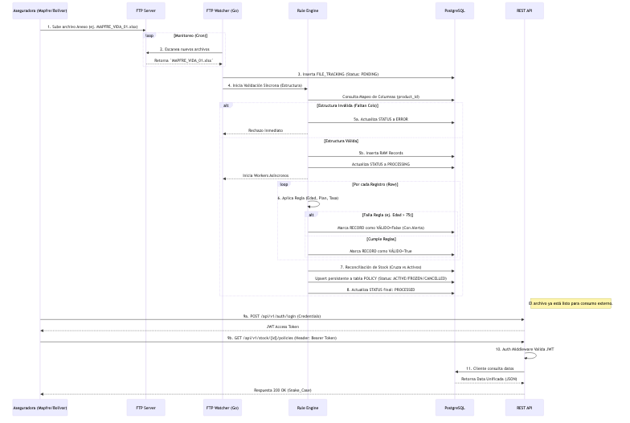

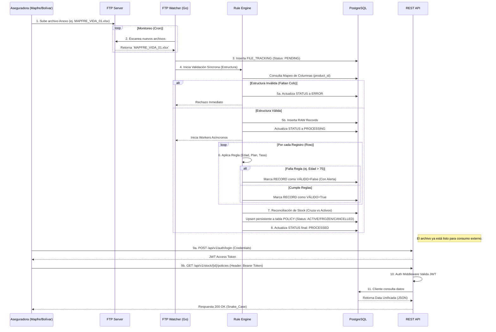

---

## 4. Jobs Asíncronos (Background Workers)
El procesamiento del sistema delega las tareas pesadas a colas asíncronas manejadas internamente por **Goroutines** (Go).

| Nombre del Job | Disparador | Tarea Principal |
|----------------|------------|-----------------|
| **`FTPWatcherJob`** | Cron (ej. cada 15 min) o `POST /process/scan` | Conecta al SFTP de Mapfre/Bolívar, identifica nuevos archivos no procesados y encola la validación síncrona. |
| **`FileProcessingJob`** | Éxito en Validación Estructural | Lee el archivo fila por fila, instancia el **Motor de Reglas**, re-calcula primas y marca cada `RECORD` como válido o inválido. |
| **`StockReconciliationJob`** | Fin exitoso del `FileProcessingJob` | Ejecuta el cruce (`DIFF`) masivo en PostgreSQL para detectar cuáles pólizas deben marcarse como `CANCELLED`, `FROZEN` o `ACTIVE`. |

---

## 5. Eventos de Dominio (Event Streaming)
Alineado con las directrices de Zalando, el motor emite **Eventos de Cambio de Datos (Data Change Events)** cuando se altera el stock. Estos eventos pueden ser consumidos por un bus de mensajería (ej. Kafka/RabbitMQ) para que otros microservicios actúen.

### Data Change Events:
- **`policy_created`**: Disparado cuando el motor detecta un `document_number` nuevo en el mes actual.
- **`policy_updated`**: Disparado cuando el deudor o asegurado tiene "novedades" (cambio en el valor cobrado o actualización de parentescos).
- **`policy_frozen`**: Emitido específicamente cuando una prima en 0 dispara la política de congelamiento.
- **`policy_cancelled`**: Emitido durante el `StockReconciliationJob` si el asegurado no aparece en el nuevo archivo mensual.

### Lifecycle Events (Flujo Operativo):
- **`file_validation_failed`**: Se emite si el Anexo viene corrupto, notificando al equipo de operaciones para que exija corrección a la aseguradora.
- **`file_processing_completed`**: Notifica que el lote completo terminó y el API ya expone el stock fresco.


# Seguridad y Control de Acceso

Dado que Busk Seguros procesa archivos que contienen información sensible sobre pólizas de asegurados e información financiera y de deudores (como reportes de MAPFRE y Bolívar), todos los accesos programáticos están resguardados por un esquema de seguridad perimetral.

## Modelo de Autenticación (JWT Bearer)

El sistema de la API REST implementa un modelo de seguridad basado en tokens temporales, utilizando el estándar **JSON Web Token (JWT)**, alineado con las especificaciones técnicas requeridas.

### 1. Interceptor / Auth Middleware
Toda petición entrante que busque consultar el "stock" o disparar comandos de control (`/process/scan`) debe pasar por un Middleware escrito en Go, el cual se asegura de:
- Verificar que el Token posea una firma válida emitida por el backend.
- Validar que el Token no esté expirado.
- (Opcional) Confirmar que el rol del usuario contenga los permisos (Scopes) necesarios para dicha operación.

### 2. Tabla de Credenciales y Roles (`APP_USER`)
El almacenamiento interno de usuarios y contraseñas (hasheadas) se realiza mediante la entidad de base de datos dedicada.

| Tabla | Campo | Tipo | Notas / Negocio |
|-------|-------|------|-----------------|
| **APP_USER** | `id` | UUID (PK) | Identificador interno |
| | `email` | STRING (UK) | Credencial de acceso (Ej. operaciones@busk.com) |
| | `password_hash` | STRING | Criptografía irreversible (Bcrypt / Scrypt) |
| | `role` | STRING | `ADMIN`, `VIEWER`, `SYSTEM` |
| | `is_active` | BOOLEAN | Corta acceso instantáneamente sin borrar registro |
| | `last_login_at` | TIMESTAMP | Registro de auditoría. |

---

## Flujo de Autorización

### 1. Intercambio de Credenciales (Login)
El integrador de software o portal web frontal (Frontend) consume el endpoint de inicio de sesión documentado en las [Firmas de API](api.md).

```http
POST /api/v1/auth/login
Content-Type: application/json

{
  "email": "asesor@busk.com",
  "password": "SuperSecretPassword123"
}
```

Si es correcto, la API devuelve el `access_token` temporal.

### 2. Consumo de API (Autorización)
El cliente debe proveer dicho `access_token` inyectándolo en las cabeceras estándar de Authorización (`Authorization`) en cada petición subsecuente.

```http
GET /api/v1/stock/MAPFRE_VIDA_XYZ/policies HTTP/1.1
Authorization: Bearer eyJhbGciOiJIUzI...
```

### Respuestas de Seguridad (RFC 7807)
Alineado con Zalando Guidelines, un error de autenticación se presentará mediante `application/problem+json`:

```json
{
  "type": "https://docs.buskseguros.com/errors/unauthorized",
  "title": "Unauthorized Request",
  "status": 401,
  "detail": "El token JWT provisto ha expirado o es inválido."
}
```


# Proceso: FTP, Prefijos y Validación

Este documento detalla la fase inicial y crítica del procesamiento de archivos.

## 1. Recuperación vía FTP
El sistema utiliza un cliente interno que se conecta periódicamente a servidores FTP/SFTP externos para buscar nuevos documentos de seguros.

---

## 2. Identificación por Prefijo
Para saber qué reglas aplicar, el sistema analiza el nombre del archivo buscando un **Prefijo Clave**:

| Prefijo | Producto Correspondiente | Anexo |
|---------|--------------------------|-------|
| `MAPFRE_VIDA_` | Voluntario Vida | Anexo 1 |
| `MAPFRE_CANCER_` | AP Cáncer | Anexo 2 |
| `MAPFRE_MENORES_` | AP Menores | Anexo 3 |
| `BOLIVAR_BANCO_` | Deudores Banco | Anexo 4 |
| `BOLIVAR_ESAL_` | Deudores ESAL | Anexo 5 |

---

## 3. Validación de Estructura (Síncrona)
**¡CRÍTICO!** Antes de cualquier inserción, el sistema valida que el archivo coincida exactamente con la parametrización guardada.

- **Verificación**: Número de columnas, nombres exactos de encabezados y orden.
- **Reporte de Error**: Si hay un cambio estructural, el sistema:
  1. Detiene el proceso inmediatamente.
  2. Registra el error en `PROCESSED_FILE`.
  3. Notifica al equipo operativo.
- **Éxito**: Si la estructura es correcta, se registra como **PENDIENTE** en la base de datos.

---

## 4. Procesamiento Asíncrono
Una vez aceptado el archivo, los registros se validan fila por fila de forma asíncrona:
1. Se ejecutan validaciones por columna (Edad, Plazo, Tasa).
2. Se guardan los resultados individualmente en la tabla `RECORD`.
3. Al finalizar, el estado del archivo cambia a `PROCESADO` o `ERROR` (si hubo fallas en registros).


# Firmas de API (Hub Técnico)

Esta sección documenta los endpoints REST disponibles para controlar y monitorear el procesamiento automatizado desde el FTP.

## 1. Control de Procesamiento

### `POST /api/v1/process/scan`
Dispara manualmente el escaneo del servidor FTP para buscar nuevos archivos.

**Descripción:** El sistema busca archivos que coincidan con los prefijos configurados (`MAPFRE_`, `BOLIVAR_`).

**Respuestas:**
- `200 OK`: Escaneo iniciado exitosamente.
- `503 Service Unavailable`: Servidor FTP no disponible.

---

### `GET /api/v1/files`
Lista todos los archivos detectados en el FTP con su estado actual.

**Filtros opcionales:** `status` (PENDIENTE, ERROR, PROCESADO, FROZEN), `productId`, `date`.

---

### `GET /api/v1/files/:id/diff`
Obtiene el reporte de diferencias (Inclusions, Cancellations y Novedades) una vez el proceso asíncrono termina.

**Esquema de Retorno:**
```json
{
  "filename": "MAPFRE_VIDA_202403.xlsx",
  "status": "PROCESSED",
  "inclusions": [ ... ],
  "cancellations": [ ... ],
  "novedades": [ ... ]
}
```

## 2. Gestión de Stock e Inventario

### `GET /api/v1/stock/:productId/policies`
Consulta el listado de pólizas activas en el stock para un producto específico.

**Parámetros de Consulta (Query):**
- `document_number`: Filtrar por número de documento (Cédula/NIT).
- `credit_id`: Filtrar por ID de crédito (Bolívar).
- `full_name`: Filtrar por nombre del asegurado (Búsqueda parcial).
- `status`: Filtrar por estado (`ACTIVE`, `FROZEN`, `CANCELLED`).
- `page` / `limit`: Control de paginación.

---

### `GET /api/v1/stock/:productId/policies/:id`
Obtiene el detalle completo de una póliza o crédito. El esquema es **unificado** para todos los productos, permitiendo que el cliente procese la información de manera genérica.

#### Esquema Unificado (Base):
| Nodo | Descripción |
|------|-------------|
| `customer_data` | Información del titular/asegurado/deudor. |
| `financial_data` | Valores monetarios, tasas y primas. |
| `reference_data` | Datos específicos del origen (Póliza Mapfre o Crédito Bolívar). |
| `validation_data` | Resultados de reglas y alertas. |

#### Ejemplo: Producto MAPFRE (Vida Voluntaria)
```json
{
  "id": "550e8400-e29b-41d4-a716-446655440000",
  "product_id": "MAPFRE_VIDA",
  "status": "ACTIVE",
  "customer_data": {
    "id_number": "12345678",
    "id_type": "CC",
    "full_name": "JUAN PEREZ",
    "gender": "M",
    "birth_date": "1985-05-15"
  },
  "financial_data": {
    "base_value": 0,
    "premium_value": 8600.00,
    "tax_value": 0,
    "total_value": 8600.00,
    "currency": "COP"
  },
  "reference_data": {
    "reference_number": "108-000456",
    "start_date": "2024-01-01",
    "end_date": "2024-12-31",
    "additional_system_info": {
      "branch": "BOGOTA",
      "plan": "PLAN A"
    }
  },
  "validation_data": {
    "is_valid": true,
    "alerts": [],
    "calculated_age": 38
  }
}
```

#### Ejemplo: Producto BOLIVAR (Deudores)
```json
{
  "id": "660e8400-e29b-41d4-a716-446655441111",
  "product_id": "BOLIVAR_BANCO",
  "status": "ACTIVE",
  "customer_data": {
    "id_number": "900123456",
    "id_type": "NIT",
    "full_name": "EMPRESA ABC SAS",
    "gender": "N/A",
    "birth_date": null
  },
  "financial_data": {
    "base_value": 25000000.00,
    "premium_value": 20825.00,
    "tax_value": 0,
    "total_value": 20825.00,
    "currency": "COP",
    "applied_rate": 0.000833
  },
  "reference_data": {
    "reference_number": "99887766",
    "start_date": "2023-11-20",
    "end_date": null,
    "additional_system_info": {
      "term_months": 60,
      "operation_type": "BT"
    }
  },
  "validation_data": {
    "is_valid": true,
    "alerts": ["MANUAL_REVIEW_REQUIRED"],
    "requires_manual_action": true
  }
}
```

---

### `POST /api/v1/stock/reload`
Reemplaza la base de stock actual con los datos consolidados del último archivo procesado exitosamente.

---

### `GET /api/v1/rules/:productId`
Consulta la parametrización de estructura y reglas aplicada para un tipo de archivo específico.

---

## 3. Manejo de Errores (RFC 7807)
Todos los errores devueltos por la API seguirán la especificación **Problem JSON (RFC 7807)** requerida por Zalando Guidelines.

```json
{
  "type": "https://docs.buskseguros.com/errors/resource-not-found",
  "title": "Stock Not Found",
  "status": 404,
  "detail": "No active policies found for product MAPFRE_VIDA_XYZ.",
  "instance": "/api/v1/stock/MAPFRE_VIDA_XYZ/policies"
}
```

---

## 4. Especificación OpenAPI 3.0 (Swagger)
A continuación, el contrato formal de integración para el consumo de políticas validadas y control de archivos.

```yaml
openapi: 3.0.3
info:
  title: Busk Seguros API
  version: 2.0.0
  description: "Contrato operativo actual para carga, validación y consulta de pólizas."
servers:
  - url: https://api.buskseguros.com/api/v1
paths:
  /health:
    get:
      summary: Estado del servicio
      tags: [System]
      responses:
        '200':
          description: Servicio OK
          content:
            application/json:
              schema:
                type: object
                properties:
                  status: { type: string }
                  time: { type: string }

  /products:
    get:
      summary: Listar productos
      tags: [Configuration]
      responses:
        '200':
          description: Lista de productos
          content:
            application/json:
              schema:
                type: array
                items:
                  $ref: '#/components/schemas/Product'
    post:
      summary: Crear o actualizar producto
      tags: [Configuration]
      requestBody:
        required: true
        content:
          application/json:
            schema:
              $ref: '#/components/schemas/Product'
      responses:
        '201':
          description: Producto creado/actualizado
          content:
            application/json:
              schema:
                $ref: '#/components/schemas/Product'

  /product-formats:
    get:
      summary: Listar formatos de producto
      tags: [Configuration]
      parameters:
        - in: query
          name: product_id
          schema:
            type: string
      responses:
        '200':
          description: Lista de formatos
          content:
            application/json:
              schema:
                type: array
                items:
                  $ref: '#/components/schemas/ProductFormat'
    post:
      summary: Crear o actualizar formato
      tags: [Configuration]
      requestBody:
        required: true
        content:
          application/json:
            schema:
              $ref: '#/components/schemas/ProductFormat'
      responses:
        '201':
          description: Formato creado/actualizado
          content:
            application/json:
              schema:
                $ref: '#/components/schemas/ProductFormat'

  /product-formats/active:
    patch:
      summary: Activar o desactivar formato
      tags: [Configuration]
      requestBody:
        required: true
        content:
          application/json:
            schema:
              type: object
              required: [id, active]
              properties:
                id: { type: string }
                active: { type: boolean }
      responses:
        '200':
          description: Estado actualizado

  /product-formats/match-test:
    post:
      summary: Probar match de formato por nombre de archivo y headers
      tags: [Configuration]
      requestBody:
        required: true
        content:
          application/json:
            schema:
              type: object
              required: [file_name, headers]
              properties:
                file_name: { type: string }
                product_id: { type: string }
                headers:
                  type: array
                  items: { type: string }
      responses:
        '200':
          description: Resultado de evaluación de candidatos

  /process/scan:
    post:
      summary: Disparar escaneo SFTP y encolar procesamiento
      tags: [Processing]
      responses:
        '202':
          description: Scan encolado

  /files:
    get:
      summary: Listar archivos procesados/encolados
      tags: [Processing]
      responses:
        '200':
          description: Lista de archivos

  /files/retry:
    post:
      summary: Reencolar archivo en estado ERROR
      tags: [Processing]
      parameters:
        - in: query
          name: file_id
          required: true
          schema: { type: string }
      responses:
        '202':
          description: Reintento encolado

  /process/progress:
    get:
      summary: Consultar progreso en tiempo real
      tags: [Processing]
      responses:
        '200':
          description: Progreso por archivo

  /products/allowed-premiums:
    get:
      summary: Consultar catálogo de primas permitidas
      tags: [Configuration]
      parameters:
        - in: query
          name: product_id
          required: true
          schema: { type: string }
      responses:
        '200':
          description: Catálogo de primas
    put:
      summary: Reemplazar catálogo de primas
      tags: [Configuration]
      requestBody:
        required: true
        content:
          application/json:
            schema:
              type: object
              required: [product_id, premiums]
              properties:
                product_id: { type: string }
                premiums:
                  type: array
                  items: { type: number }
      responses:
        '200':
          description: Catálogo actualizado
    post:
      summary: Agregar una prima al catálogo
      tags: [Configuration]
      requestBody:
        required: true
        content:
          application/json:
            schema:
              type: object
              required: [product_id, premium]
              properties:
                product_id: { type: string }
                premium: { type: number }
      responses:
        '201':
          description: Prima agregada
    delete:
      summary: Eliminar prima específica o vaciar catálogo
      tags: [Configuration]
      parameters:
        - in: query
          name: product_id
          required: true
          schema: { type: string }
        - in: query
          name: premium
          required: false
          schema: { type: number }
      responses:
        '200':
          description: Catálogo actualizado

  /policies/search:
    get:
      summary: Buscar pólizas con paginación
      tags: [Policies]
      parameters:
        - in: query
          name: product_id
          required: false
          schema: { type: string }
        - in: query
          name: document_number
          schema: { type: string }
        - in: query
          name: credit_number
          schema: { type: string }
        - in: query
          name: page
          schema: { type: integer, minimum: 1 }
        - in: query
          name: page_size
          schema: { type: integer, minimum: 1, maximum: 200 }
        - in: query
          name: include_raw
          schema: { type: boolean }
      responses:
        '200':
          description: Resultado paginado
          content:
            application/json:
              schema:
                type: object
                properties:
                  items:
                    type: array
                    items:
                      $ref: '#/components/schemas/Policy'

  /policies:
    get:
      summary: Listar pólizas por producto (opcional por estado)
      tags: [Policies]
      parameters:
        - in: query
          name: product_id
          required: true
          schema: { type: string }
        - in: query
          name: status
          required: false
          schema: { type: string }
        - in: query
          name: limit
          required: false
          schema: { type: integer, minimum: 0 }
        - in: query
          name: include_raw
          required: false
          schema: { type: boolean }
      responses:
        '200':
          description: Lista de pólizas
          content:
            application/json:
              schema:
                type: object
                properties:
                  items:
                    type: array
                    items:
                      $ref: '#/components/schemas/Policy'

components:
  schemas:
    Product:
      type: object
      properties:
        id: { type: string }
        code: { type: string }
        insurer: { type: string }
    Policy:
      type: object
      properties:
        id:
          type: string
          description: Identificador lógico (file_id:row_number)
        file_id:
          type: string
        product_id:
          type: string
        file_name:
          type: string
        row_number:
          type: integer
        status:
          type: string
        customer_data:
          type: object
        financial_data:
          type: object
        reference_data:
          type: object
        validation_data:
          type: object
        raw_data:
          type: object
          nullable: true
        validation_notes:
          type: array
          items: { type: string }
    ProductFormat:
      type: object
      properties:
        id: { type: string }
        product_id: { type: string }
        name: { type: string }
        file_prefix: { type: string }
        sheet_name: { type: string }
        header_row: { type: integer }
        priority: { type: integer }
        active: { type: boolean }
        mappings:
          type: array
          items:
            $ref: '#/components/schemas/FieldMap'
        rules:
          type: array
          items:
            $ref: '#/components/schemas/RuleConfig'
    FieldMap:
      type: object
      properties:
        canonical_field: { type: string }
        source_header: { type: string }
        required: { type: boolean }
    RuleConfig:
      type: object
      properties:
        type: { type: string }
        field: { type: string }
        params:
          type: object
          additionalProperties:
            type: number
    Problem:
      type: object
      properties:
        type:
          type: string
          format: uri
        title:
          type: string
        status:
          type: integer
        detail:
          type: string
        instance:
          type: string
          format: uri
```


# Esquema de Base de Datos Completo

El sistema utiliza PostgreSQL para almacenar la trazabilidad del proceso y el stock histórico.

## Modelo de Datos Visual


## Diccionario de Datos

| Tabla | Columna | Tipo | Lógica de Negocio |
|-------|--------|------|----------------|
| **PRODUCT** | `id` | UUID (PK) | Identificador único |
| | `code` | STRING (UK) | ID interno (ej. MAPFRE_VIDA) |
| | `insurer` | STRING | Aseguradora: MAPFRE o BOLIVAR |
| | `column_mapping` | JSONB | Mapeo de columnas Excel a campos DB |
| **POLICY (Stock Activo)** | `id` | UUID (PK) | |
| | `product_id` | UUID (FK) | |
| | `document_type` | STRING | CC, NIT, TI, etc. |
| | `document_number` | STRING | **Indexado** (Llave Mapfre) |
| | `credit_id` | STRING | **Indexado** (Llave Bolívar) |
| | `full_name` | STRING | **Indexado** (Búsqueda rápida) |
| | `birth_date` | DATE | Para validación de edad |
| | `gender` | STRING | M, F, N/A |
| | `status` | STRING | **Indexado** (ACTIVE, FROZEN, etc.) |
| | `premium_value` | NUMERIC | Valor para cálculos inmediatos |
| | `metadata` | JSONB | Otros campos específicos (Beneficiarios, etc.) |
| | `updated_at` | TIMESTAMP | |
| **RULE** | `id` | UUID (PK) | |
| | `product_id` | UUID (FK) | Producto padre |
| | `rule_type` | STRING | edad, plan, tasa, duplicados |
| | `parameters` | JSONB | Ej. `{"max_age": 75, "min_age": 18}` |

### Seguridad y Control de Acceso (Usuarios)
Para garantizar la confidencialidad de la información (pólizas), el API está resguardada por autenticación JWT.

| Tabla | Campo | Tipo | Notas / Negocio |
|-------|-------|------|-----------------|
| **APP_USER** | `id` | UUID (PK) | Identificador interno |
| | `email` | STRING (UK) | Credencial de acceso |
| | `password_hash` | STRING | Bcrypt / Scrypt |
| | `role` | STRING | ADMIN, VIEWER, SYSTEM |
| | `is_active` | BOOLEAN | Control de acceso rápido |
| | `last_login_at` | TIMESTAMP | Auditoría |

---
| **PROCESSED_FILE** | `id` | UUID (PK) | |
| | `status` | STRING | RECIBIDO, PENDIENTE, PROCESANDO, LISTO, ERROR |
| | `error_report` | JSONB | Reporte detallado de errores de validación |
| **RECORD** | `id` | UUID (PK) | |
| | `file_id` | UUID (FK) | |
| | `raw_data` | JSONB | Contenido completo de la fila original |
| | `status` | STRING | VÁLIDO o INVÁLIDO |
---

## Recomendaciones de Escalabilidad (Millones de Registros)

Para manejar millones de registros eficientemente en PostgreSQL sin migrar a una NoSQL, se seguirán estas estrategias:

### 1. Esquema Híbrido (Propuesto)
En lugar de un JSON masivo, extraemos los campos que se comparten entre todos los productos (Nombre, ID, Estado, Valor) a **columnas físicas**.
- **Ventaja**: Las búsquedas por Nombre o Cédula no tocan el JSON, optimizando el uso de memoria y CPU.
- **Flexibilidad**: El resto de campos (ej. "Parentesco del beneficiario" en Mapfre o "Plazo" en Bolívar) se queda en el JSON.

### 2. Índices B-Tree vs GIN
- Usaremos **B-Tree** convencionales para las columnas externas.
- Usaremos **GIN** solo en el campo `metadata` para búsquedas sobre campos que no logramos prever como compartidos.

### 2. Particionamiento de Tablas
Para evitar que una sola tabla crezca indefinidamente, se recomienda **Particionamiento por Lista** usando el `product_id`.
- Cada producto (Mapfre Vida, Bolivar Banco, etc.) tendrá su propia partición física en disco, mejorando drásticamente el rendimiento de las consultas y el mantenimiento.

### 3. Compresión TOAST
PostgreSQL gestiona grandes bloques de datos (como JSONs extensos) mediante **TOAST**, almacenándolos fuera de la tabla principal y comprimiéndolos automáticamente, lo que mantiene los índices pequeños y rápidos.

> [!NOTE]
> Con estas técnicas, PostgreSQL puede manejar cientos de millones de registros manteniendo la integridad relacional (ACID), algo que se pierde o se vuelve complejo en una NoSQL pura como MongoDB.


# Catálogo de Productos y Estructuras (Anexos)

El sistema soporta 5 productos principales, cada uno basado en la estructura de los archivos anexos proporcionados.

## 1. MAPFRE - Vida Voluntaria (Anexo 1)
- **Prefijo Sugerido**: `MAPFRE_VIDA_`
- **Columnas Clave**:
  - `NUM DOCUM`: Llave primaria.
  - `FECHA NAC`: Para validación de edad (18-75 años).
  - `PRIMA MENSUAL`: Valores válidos ($8,600 o $17,100).
- **Características**: Archivo extenso (>100 columnas) con datos de beneficiarios y tomador.

## 2. MAPFRE - AP Cáncer (Anexo 2)
- **Prefijo Sugerido**: `MAPFRE_CANCER_`
- **Columnas Clave**:
  - `NUM DOCUM`: Llave primaria.
  - `FECHA NAC`: Validación de edad (18-70 años).
  - `VALOR PRIMA`: $8,500 o $13,000.

## 3. MAPFRE - AP Menores (Anexo 3)
- **Prefijo Sugerido**: `MAPFRE_MENORES_`
- **Columnas Clave**:
  - `NUM DOCUM`: Llave primaria.
  - `PRIMA`: $7,800, $7,410, $10,600 o $10,070.

## 4. BOLIVAR - Deudores Banco (Anexo 4)
- **Prefijo Sugerido**: `BOLIVAR_BANCO_`
- **Columnas Clave**:
  - `NUMERO DE CREDITO`: Llave primaria.
  - `DEUDA INICIAL`: Base para cálculo de prima.
  - `PRIMA MENSUAL`: Validada mediante `DEUDA * TASA`.
  - `PLAZO`: Validado contra fechas de adjudicación y vencimiento.

## 5. BOLIVAR - Deudores ESAL (Anexo 5)
- **Prefijo Sugerido**: `BOLIVAR_ESAL_`
- **Columnas Clave**:
  - Similar a Deudores Banco pero con tasa y reglas específicas para Entidades Sin Ánimo de Lucro (ESAL).
  - Validación de créditos > $20M (Requiere revisión manual).

---

# Parametrización Operativa (Actual)

Esta sección documenta **cómo crear/actualizar productos y formatos** y qué reglas son parametrizables hoy en la API.

## 1) Modelo actual de configuración

- Un **producto** define identidad funcional (`id`, `code`, `insurer`).
- Un producto puede tener **N formatos** (`product-formats`) con distinto `file_prefix`, mapeos y reglas.
- El `file_prefix` se maneja en **formatos**, no en producto.

## 2) Endpoints de configuración

- `POST /api/v1/products`: crea/actualiza producto base.
- `GET /api/v1/products`: lista productos.
- `POST /api/v1/product-formats`: crea/actualiza formato de archivo de un producto.
- `GET /api/v1/product-formats?product_id=...`: lista formatos (opcionalmente filtrado).
- `PATCH /api/v1/product-formats/active`: activa/desactiva formato.
- `PUT /api/v1/products/allowed-premiums`: reemplaza catálogo de primas permitidas.
- `POST /api/v1/products/allowed-premiums`: agrega prima permitida.
- `DELETE /api/v1/products/allowed-premiums?...`: elimina prima permitida.

## 3) Payloads de referencia

### 3.1 Crear/actualizar producto

```json
{
  "id": "mapfre_stock",
  "code": "MAPFRE_STOCK",
  "insurer": "MAPFRE"
}
```

### 3.2 Crear/actualizar formato del producto

```json
{
  "id": "mapfre_stock_fmt_vf2",
  "product_id": "mapfre_stock",
  "name": "stock vf2 2026",
  "file_prefix": "STOCK_MAPFRE",
  "sheet_name": "Hoja1",
  "header_row": 1,
  "priority": 100,
  "active": true,
  "mappings": [
    { "canonical_field": "document_number", "source_header": "IDENTIFICACIONAFILIADO", "required": true },
    { "canonical_field": "birth_date", "source_header": "FECHANACIMIENTO", "required": true },
    { "canonical_field": "monthly_premium", "source_header": "PRIMAMENSUALPERIODO", "required": true },
    { "canonical_field": "credit_number", "source_header": "NUMEROPRESTAMO", "required": true },
    { "canonical_field": "coverage_start_date", "source_header": "FECHA INICIO DE VIGENCIA", "required": true },
    { "canonical_field": "coverage_end_date", "source_header": "FECHAFINVIGENCIADERIESGO REAL", "required": true }
  ],
  "rules": [
    { "type": "required_not_empty", "field": "document_number", "params": {} },
    { "type": "required_not_empty", "field": "birth_date", "params": {} },
    { "type": "required_not_empty", "field": "credit_number", "params": {} },
    { "type": "number_gte", "field": "monthly_premium", "params": { "min": 0 } },
    { "type": "freeze_on_zero_premium", "field": "monthly_premium", "params": {} }
  ]
}
```

### 3.3 Activar / desactivar formato

```json
{
  "id": "mapfre_stock_fmt_vf2",
  "active": false
}
```

## 4) Reglas parametrizables por BD

### 4.1 Parámetros globales (`global_rule_params`)

- `date_layouts_csv`  
  Formatos de fecha aceptados (ej. `2006-01-02,02/01/2006,02-01-2006`).
- `mapfre_cancel_keywords_csv`  
  Palabras clave para etiquetar flujo de cancelaciones MAPFRE por nombre de archivo.

### 4.2 Parámetros por producto (`product_rule_params`)

- `required_valid_date_fields_csv`  
  Campos que deben venir no vacíos y parseables a fecha.  
  Ejemplo MAPFRE: `birth_date,coverage_start_date,coverage_end_date`.
- `age_min`, `age_max`  
  Rango de edad permitido.
- `mapfre_require_current_month`  
  `1`/`0`: exige que `coverage_start_date` esté en el mes actual.
- `mapfre_date_tolerance_days`  
  Tolerancia (+/- días) para validar `coverage_end_date` vs plazo inicial.
- `debt_manual_threshold`  
  Umbral para marcar revisión manual por deuda alta (Bolívar).

### 4.3 Catálogo de primas por producto (`product_allowed_premiums`)

- Lista de valores de prima permitidos por `product_id`.
- Si la prima no pertenece al catálogo, la póliza queda en novedad/manual según modo del producto.

## 5) Reglas de archivo vs reglas de negocio

- `mappings` y `rules` dentro del **formato** controlan estructura y validaciones base por columna.
- `product_rule_params` y `product_allowed_premiums` controlan reglas de negocio configurables por producto.
- El motor selecciona el formato por `file_prefix` + compatibilidad de encabezados requeridos + prioridad.


# Lógica de Negocio y Flujo de Datos

## 1. Origen y Identificación
El sistema no solo monitorea carpetas locales, sino que se conecta a un **servidor FTP** para descargar archivos.

### Identificación por Prefijo (a nivel de formato):
Cada archivo es identificado mediante un **Prefijo o Nombre Clave del formato**.  
El prefijo **no pertenece al producto**, pertenece al formato (`product-formats`), permitiendo múltiples layouts por un mismo producto.
Ejemplo: `STOCK_MAPFRE_Febrero_vf2_2026.xlsx` -> Producto `mapfre_stock`, Formato `mapfre_stock_fmt_vf2`.

---

## 2. Validación de Estructura (Síncrona)
Antes de procesar cualquier registro, el sistema verifica que la **estructura del archivo** sea idéntica a la parametrizada (nombres de columnas, orden y tipos).

- **Si cambia la estructura**: Se detiene el proceso y se reporta el error de inmediato sin cargar datos.
- **Si la estructura es válida**: El archivo se registra en la base de datos con estado **"PENDIENTE"** para su procesamiento posterior.

---

## 3. Procesamiento Asíncrono de Registros
Una vez que el archivo es aceptado estructuralmente, un proceso asíncrono recorre cada registro para ejecutar las validaciones de columna (Edad, Plan, Tasa, etc.).

### Flujo de Registro:
1. **Validación de Columna**: Se ejecutan las reglas individuales.
2. **Persistencia**: Se guarda el resultado de cada registro individualmente.
3. **Cruce de Stock**: Se determinan Inclusiones, Cancelaciones y Novedades.

### Reglas Específicas del Diagrama Base (PDF Original):
El Motor Asíncrono debe programar e instanciar obligatoriamente las siguientes reglas funcionales extraídas del modelo de flujo:

**A. Reglas Comunes y de Vida (Mapfre)**
- **Regla de Edad**: Se valida contra el parámetro del producto (ej. *18 a 75 años* para Vida Voluntario, *18 a 70 años* para AP Menores/Cáncer). Un deudor que incumpla se marca con Novedad/Error.
- **Regla de Plan (Tarifario)**: La `PRIMA` (ej. $8,600 o $17,100) debe estar en el diccionario estricto del producto.
- **Control de Siniestros**: Cruce de la Cédula (`NUM DOCUM`) contra la tabla o servicio externo de fallecimientos reportados. Genera marca de alerta inmediata.

**B. Reglas de Crédito (Bolívar)**
- **Control de Tasa**: `DEUDA INICIAL` × `% Tasa` debe ser exactamente igual a la `PRIMA MENSUAL` reportada.
- **Montos Superiores a 20 Millones**: Si `DEUDA INICIAL` > `$20,000,000`, el sistema aprueba la estructura pero levanta bandera `MANUAL_REVIEW_REQUIRED` (No se emite automáticamente).
- **Control de Duplicidad**: Búsqueda en Stock Histórico e Interno para asegurar que la Operación (`OP BT`) no se ha cruzado doblemente en el mismo mes.

---

## 2. Prioridades del Motor de Reglas

| Prioridad | Nivel | Acción ante Falla |
|----------|-------|-------------------|
| **1** | Estructura | Rechazar archivo completo |
| **2** | Datos Críticos | Marcar registro como INVÁLIDO, rechazar archivo |
| **3** | Política de Negocio | Marcar como Novedad, requiere revisión manual |
| **4** | Metadatos | Advertencia de baja prioridad |

---

## 4. Reconciliación y Gestión de Vigencia
Para determinar qué pólizas siguen vigentes, el sistema realiza una **Reconciliación de Stock** al finalizar el procesamiento asíncrono.

### Lógica de Desactivación:
1. **Identificar Vigencia**: Se seleccionan todas las pólizas en la tabla `POLICY` que pertenecen al `product_id` del archivo actual.
2. **Cruce (Diff)**: El sistema busca cuáles de esas pólizas **NO** están presentes en el nuevo archivo cargado.
3. **Desactivación Automática**: Aquellas pólizas ausentes en el nuevo archivo se marcan automáticamente como `CANCELLED` o `INACTIVE`.
4. **Actualización**: Las pólizas que sí están presentes se actualizan con la nueva información del archivo (Novedades).

---

## 5. Política de Congelamiento
Una regla especial aplicada durante la validación asíncrona es el **Congelamiento de Póliza**.

- **Condición**: Si el valor de la prima (`premium_value` / `prima`) llega en **0** en el archivo para ciertos productos.
- **Acción**: La póliza NO se cancela ni se marca como error. En su lugar, el sistema la marca con el estado **`FROZEN` (Congelada)**.
- **Efecto**: La póliza sigue marcada como "Activa" bajo esta política especial, permitiendo que la cobertura se mantenga o se suspenda según la lógica interna, pero sin perder la persistencia en el stock.


