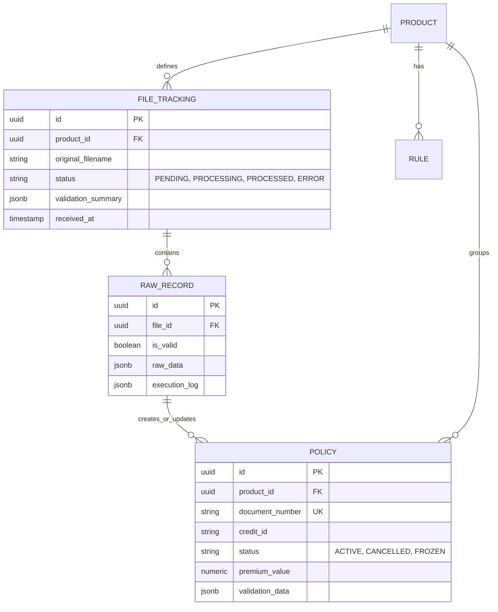
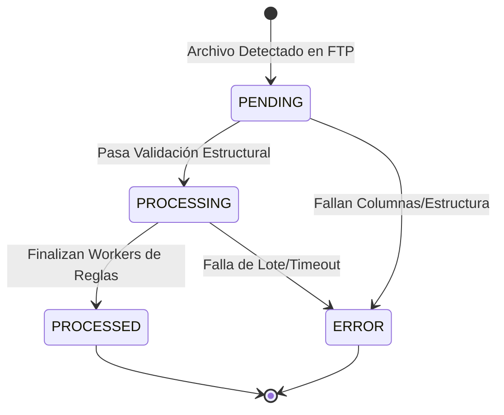
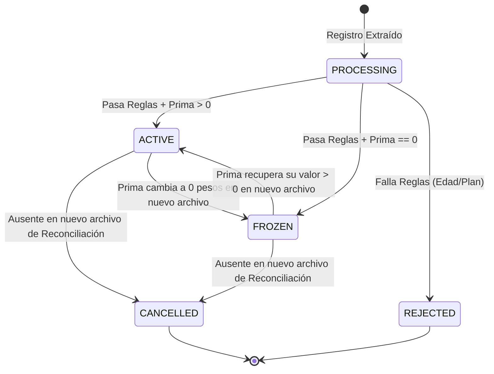
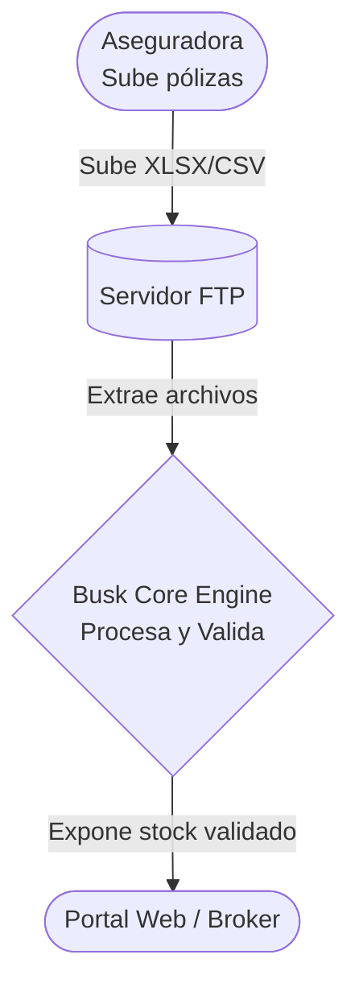
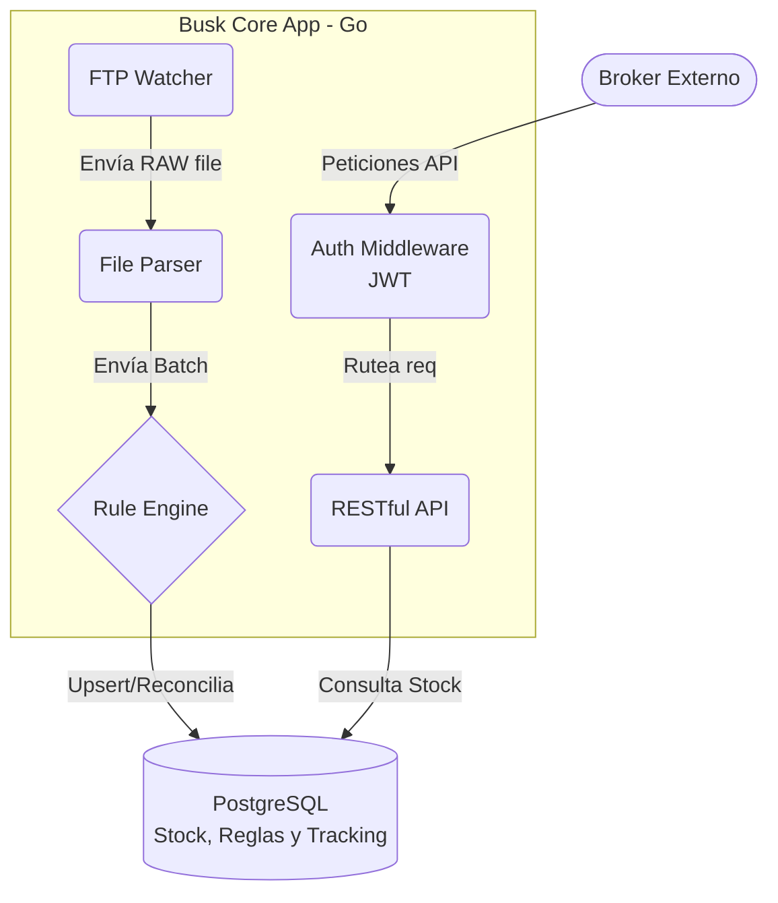
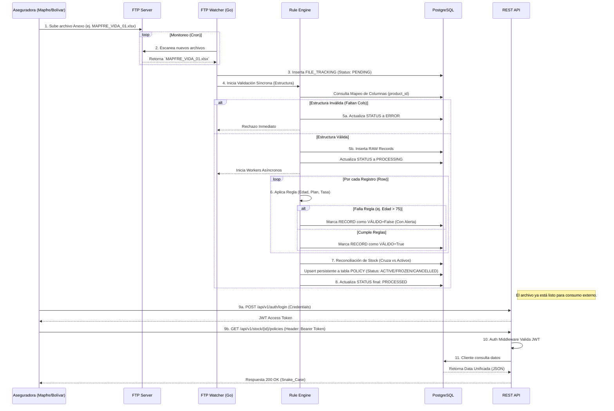

# Arquitectura de Infraestructura

Representación visual de los componentes del sistema y el ciclo de vida del procesamiento de documentos.

---

## 1. Modelos Visuales de Referencia
Para comprender rápidamente la magnitud y funcionamiento del sistema, revisa los modelos conceptuales aprobados:

### Modelo de Entidades (ERD)
Para claridad conceptual, a continuación las entidades core y sus relaciones principales en la base de datos:

### Ciclo de Vida del Archivo (File Tracking)
Controla el estado operativo del procesamiento en bloque de un Anexo FTP.

### Flujo de Estados de Póliza (Policy)
A nivel de fila única individual; el ciclo de vida de un asegurado/deudor a partir de las reglas asíncronas.

### Modelo de Componentes General (Estructura de Carpetas)
- `/api`: Endpoints REST Fiber/Gin.
- `/jobs`: Background Workers (FTP, Reconciliación).
- `/rules`: Motor de Validación Síncrono y Asíncrono.
- `/models`: Structs (Entidades) de la BD.

---

## 2. Arquitectura de Componentes (C4 Model)
El sistema está diseñado en Go (Golang) para alto rendimiento, interactuando con un servidor FTP externo y una base de datos PostgreSQL.

### Componentes Internos (Go)

---

## 3. Flujo de Integración y Procesamiento (Secuencia)
El siguiente diagrama detalla la integración End-to-End desde que la aseguradora sube el archivo hasta que queda disponible en la API.

---

## 4. Jobs Asíncronos (Background Workers)
El procesamiento del sistema delega las tareas pesadas a colas asíncronas manejadas internamente por **Goroutines** (Go).

| Nombre del Job | Disparador | Tarea Principal |
|----------------|------------|-----------------|
| **`FTPWatcherJob`** | Cron (ej. cada 15 min) o `POST /process/scan` | Conecta al SFTP de Mapfre/Bolívar, identifica nuevos archivos no procesados y encola la validación síncrona. |
| **`FileProcessingJob`** | Éxito en Validación Estructural | Lee el archivo fila por fila, instancia el **Motor de Reglas**, re-calcula primas y marca cada `RECORD` como válido o inválido. |
| **`StockReconciliationJob`** | Fin exitoso del `FileProcessingJob` | Ejecuta el cruce (`DIFF`) masivo en PostgreSQL para detectar cuáles pólizas deben marcarse como `CANCELLED`, `FROZEN` o `ACTIVE`. |

---

## 5. Eventos de Dominio (Event Streaming)
Alineado con las directrices de Zalando, el motor emite **Eventos de Cambio de Datos (Data Change Events)** cuando se altera el stock. Estos eventos pueden ser consumidos por un bus de mensajería (ej. Kafka/RabbitMQ) para que otros microservicios actúen.

### Data Change Events:
- **`policy_created`**: Disparado cuando el motor detecta un `document_number` nuevo en el mes actual.
- **`policy_updated`**: Disparado cuando el deudor o asegurado tiene "novedades" (cambio en el valor cobrado o actualización de parentescos).
- **`policy_frozen`**: Emitido específicamente cuando una prima en 0 dispara la política de congelamiento.
- **`policy_cancelled`**: Emitido durante el `StockReconciliationJob` si el asegurado no aparece en el nuevo archivo mensual.

### Lifecycle Events (Flujo Operativo):
- **`file_validation_failed`**: Se emite si el Anexo viene corrupto, notificando al equipo de operaciones para que exija corrección a la aseguradora.
- **`file_processing_completed`**: Notifica que el lote completo terminó y el API ya expone el stock fresco.
