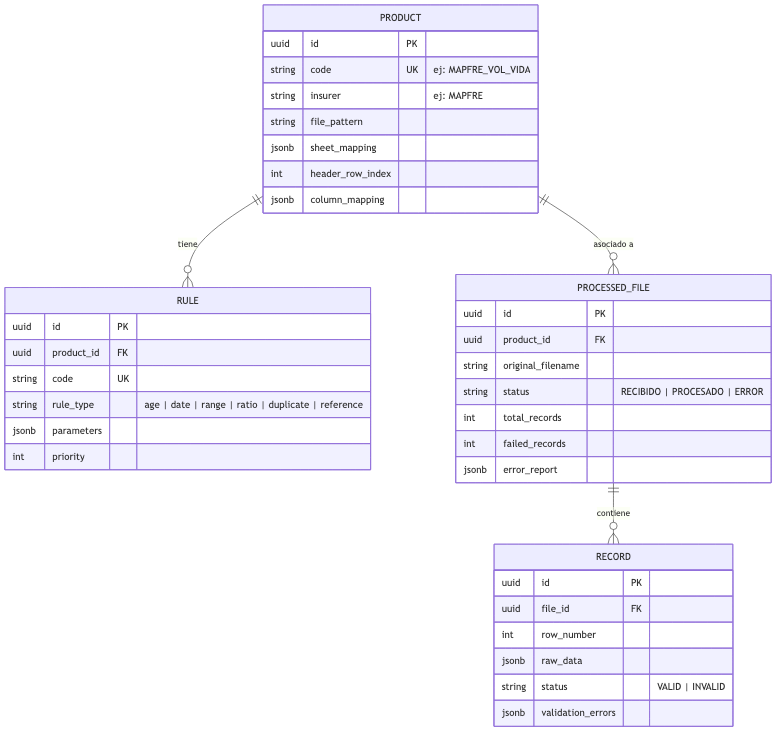

# Esquema de Base de Datos Completo

El sistema utiliza PostgreSQL para almacenar la trazabilidad del proceso y el stock histórico.

## Modelo de Datos Visual

## Diccionario de Datos

| Tabla | Columna | Tipo | Lógica de Negocio |
|-------|--------|------|----------------|
| **PRODUCT** | `id` | UUID (PK) | Identificador único |
| | `code` | STRING (UK) | ID interno (ej. MAPFRE_VIDA) |
| | `insurer` | STRING | Aseguradora: MAPFRE o BOLIVAR |
| | `column_mapping` | JSONB | Mapeo de columnas Excel a campos DB |
| **POLICY (Stock Activo)** | `id` | UUID (PK) | |
| | `product_id` | UUID (FK) | |
| | `document_type` | STRING | CC, NIT, TI, etc. |
| | `document_number` | STRING | **Indexado** (Llave Mapfre) |
| | `credit_id` | STRING | **Indexado** (Llave Bolívar) |
| | `full_name` | STRING | **Indexado** (Búsqueda rápida) |
| | `birth_date` | DATE | Para validación de edad |
| | `gender` | STRING | M, F, N/A |
| | `status` | STRING | **Indexado** (ACTIVE, FROZEN, etc.) |
| | `premium_value` | NUMERIC | Valor para cálculos inmediatos |
| | `metadata` | JSONB | Otros campos específicos (Beneficiarios, etc.) |
| | `updated_at` | TIMESTAMP | |
| **RULE** | `id` | UUID (PK) | |
| | `product_id` | UUID (FK) | Producto padre |
| | `rule_type` | STRING | edad, plan, tasa, duplicados |
| | `parameters` | JSONB | Ej. `{"max_age": 75, "min_age": 18}` |

### Seguridad y Control de Acceso (Usuarios)
Para garantizar la confidencialidad de la información (pólizas), el API está resguardada por autenticación JWT.

| Tabla | Campo | Tipo | Notas / Negocio |
|-------|-------|------|-----------------|
| **APP_USER** | `id` | UUID (PK) | Identificador interno |
| | `email` | STRING (UK) | Credencial de acceso |
| | `password_hash` | STRING | Bcrypt / Scrypt |
| | `role` | STRING | ADMIN, VIEWER, SYSTEM |
| | `is_active` | BOOLEAN | Control de acceso rápido |
| | `last_login_at` | TIMESTAMP | Auditoría |

---
| **PROCESSED_FILE** | `id` | UUID (PK) | |
| | `status` | STRING | RECIBIDO, PENDIENTE, PROCESANDO, LISTO, ERROR |
| | `error_report` | JSONB | Reporte detallado de errores de validación |
| **RECORD** | `id` | UUID (PK) | |
| | `file_id` | UUID (FK) | |
| | `raw_data` | JSONB | Contenido completo de la fila original |
| | `status` | STRING | VÁLIDO o INVÁLIDO |
---

## Recomendaciones de Escalabilidad (Millones de Registros)

Para manejar millones de registros eficientemente en PostgreSQL sin migrar a una NoSQL, se seguirán estas estrategias:

### 1. Esquema Híbrido (Propuesto)
En lugar de un JSON masivo, extraemos los campos que se comparten entre todos los productos (Nombre, ID, Estado, Valor) a **columnas físicas**.
- **Ventaja**: Las búsquedas por Nombre o Cédula no tocan el JSON, optimizando el uso de memoria y CPU.
- **Flexibilidad**: El resto de campos (ej. "Parentesco del beneficiario" en Mapfre o "Plazo" en Bolívar) se queda en el JSON.

### 2. Índices B-Tree vs GIN
- Usaremos **B-Tree** convencionales para las columnas externas.
- Usaremos **GIN** solo en el campo `metadata` para búsquedas sobre campos que no logramos prever como compartidos.

### 2. Particionamiento de Tablas
Para evitar que una sola tabla crezca indefinidamente, se recomienda **Particionamiento por Lista** usando el `product_id`.
- Cada producto (Mapfre Vida, Bolivar Banco, etc.) tendrá su propia partición física en disco, mejorando drásticamente el rendimiento de las consultas y el mantenimiento.

### 3. Compresión TOAST
PostgreSQL gestiona grandes bloques de datos (como JSONs extensos) mediante **TOAST**, almacenándolos fuera de la tabla principal y comprimiéndolos automáticamente, lo que mantiene los índices pequeños y rápidos.

> [!NOTE]
> Con estas técnicas, PostgreSQL puede manejar cientos de millones de registros manteniendo la integridad relacional (ACID), algo que se pierde o se vuelve complejo en una NoSQL pura como MongoDB.
