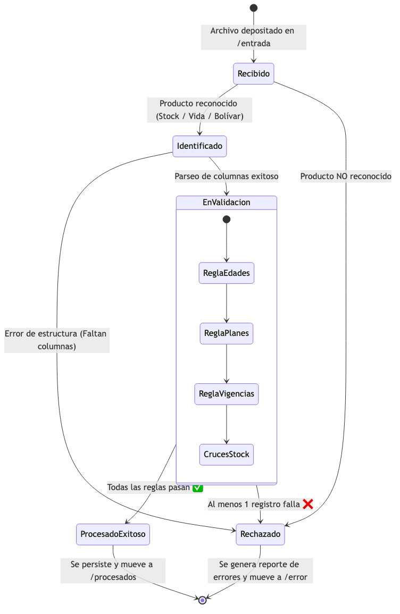
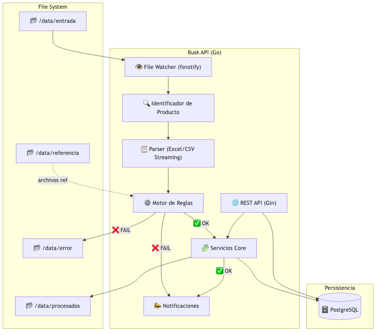

# Análisis de Proceso: Procesamiento de Documentos Busk Seguros

> **Fecha:** 11 de Marzo de 2026  
> **Fuente:** Diagrama de proceso MAPFRE / BOLÍVAR y Anexos 1 al 5

Este documento describe **exclusivamente el flujo de negocio y las reglas operativas** para la recepción, validación y procesamiento de archivos de inclusiones y controles.

---

## 1. Visión General del Proceso de Negocio

El proceso operativo busca automatizar la revisión de archivos enviados por las aseguradoras (MAPFRE y BOLÍVAR). Diariamente, se reciben documentos con cientos o miles de registros de pólizas, los cuales deben superar una serie de controles y cruces de información antes de considerarse "Procesados Exitosamente" o "Rechazados".

### 1.1 Flujo Operativo

1. **Recepción del Archivo:** Se recibe un documento (Excel/CSV) correspondiente a un producto específico (ej. Vida Voluntaria, Deudores Bolívar).
2. **Revisión de Estructura:** Se debe asegurar que el documento venga con las columnas esperadas y en la hoja de cálculo correcta, ya que algunos archivos tienen múltiples pestañas o filas iniciales en blanco.
3. **Aplicación de Controles (Reglas de Negocio):** Cada fila (asegurado o deudor) es evaluada contra las políticas definidas en el diagrama de flujo.
4. **Cruce de Información:** Algunas pólizas se deben cruzar contra bases históricas ("Stock") o reportes de siniestros.
5. **Veredicto del Archivo:** 
   - Si **TODOS** los registros cumplen las políticas, el archivo completo se marca como `Aprobado` y sus datos se consolidan.
   - Si **UN SOLO REGISTRO** incumple una regla, el archivo completo se marca como `Rechazado`. Se debe generar un informe detallado explicando exactamente qué fila y qué regla falló para que el equipo operativo gestione la corrección con la aseguradora.

---

## 2. Catálogo de Productos y Archivos

El proceso maneja 5 estructuras principales de archivos, cada una con un propósito y reglas distintas:

### MAPFRE
1. **Voluntario VIDA** (Anexo 1): Control de ingresos para seguros de vida.
2. **AP Cáncer** (Anexo 2): Control de ingresos para accidentes personales con cobertura de cáncer.
3. **AP Menores** (Anexo 3): Control de ingresos para accidentes personales de menores.

### BOLÍVAR
4. **Deudores Banco Bolívar** (Anexo 4): Inclusiones de deudores de la línea bancaria.
5. **Deudores ESAL Bolívar** (Anexo 5): Inclusiones de deudores de la línea de entidades sin ánimo de lucro (ESAL).

> **Nota Operativa:** Los archivos de MAPFRE son extremadamente detallados (más de 100 columnas, reportando toda la información del tomador, asegurado, beneficiarios, continuidades), mientras que los de Bolívar son más concisos (aprox. 25 columnas enfocadas en el crédito).

---

## 3. Reglas de Validación y Lógica de Negocio

Para revisar los archivos, se deben aplicar matemáticamente y lógicamente los controles extraídos del diagrama de flujo.

### 3.1 Controles MAPFRE (Vida, AP Cáncer, AP Menores)

**Archivos de referencia:** Anexos 1, 2 y 3. Las columnas clave identificadas en el proceso son:

| Control Operativo | Descripción y Lógica de Negocio | Columnas Exactas en el Archivo (Excel) |
|-------------------|---------------------------------|----------------------------------------|
| **Control de Edades** | Se debe calcular la edad exacta en años, meses y días. • **Voluntario VIDA:** 18 a 75 años con 364 días. • **AP Menores / AP Cáncer:** 18 a 70 años con 364 días. | `FECHA NAC` (fecha de nacimiento del asegurado, ej. Col 14) contra la fecha de proceso. |
| **Control de Planes** | Se debe cruzar el valor cobrado contra el tarifario oficial del plan para confirmar que exista. • **Voluntario VIDA:** Valores válidos = $8,600 o $17,100. • **AP Menores:** Valores válidos = $7,800, $7,410, $10,600 o $10,070. • **AP Cáncer:** Valores válidos = $8,500 o $13,000. | `PRIMA MENSUAL` o `PRIMA` (valor monetario del plan seleccionado, ej. Col 18 o 22). |
| **Control de Vigencias** | La aseguradora cobra "mes vencido". Por tanto, la **Fecha de Activación** (fecha de venta) debe corresponder al mismo mes que se está facturando. Adicionalmente, el cálculo de plazo debe ser coherente. | `FECHA INICIO DE VIGENCIA` y `FECHAFINVIGENCIADERIESGO REAL`. |
| **Cruce de Stock** | Para detectar "novedades", se cruza la base nueva con la base del mes anterior ("Stock"). Si un asegurado ya estaba, se aplican reglas de renovación; si no, es inclusión. | Se utilizan `POLIZA GRUPO` (Col 3) y `NUMERO DE CREDITO` o `COD CEDULA` (Col 12) como llaves primarias de cruce. |
| **Control Siniestros** | Se cruza la cédula del asegurado contra el listado de siniestros recientes (fallecimientos). Si existe, la inclusión/renovación debe ser marcada indicando el siniestro. | `NUM DOCUM` o `COD CEDULA` cruzado contra la base externa de siniestros. Se reporta en las columnas de `OBSERVACIÓN`. |

---

### 3.2 Controles BOLÍVAR (Banco y ESAL)

**Archivos de referencia:** Anexos 4 y 5. Las columnas clave identificadas en el proceso son:

| Control Operativo | Descripción y Lógica de Negocio | Columnas Exactas en el Archivo (Excel) |
|-------------------|---------------------------------|----------------------------------------|
| **Control de Tasa (Prima)** | El valor mensual cobrado debe ser exactamente el porcentaje acordado sobre la deuda inicial. **Fórmula:** `DEUDA INICIAL` × `%` = `PRIMA MENSUAL ` | `DEUDA INICIAL` (ej. 12000000), `%` (ej. 0.000833), y `PRIMA MENSUAL ` (debe dar 9996). |
| **Control de Plazo** | El tiempo de vigencia del seguro debe coincidir con el plazo del crédito reportado. **Fórmula Excel de origen:** `=ROUNDDOWN(_xlfn.DAYS() / 30,0)`. Se validan los meses transcurridos entre Adjudicación y Vencimiento. | `FECHA ADJUDICACION `, `FECHA VENCIMIENTO ACTUAL` o `FECHA VENCIMIENTO`, validado contra la columna `PLAZO CALCULADO`. |
| **Control de Edades** | El deudor debe estar dentro de la política de suscripción. • **Bolívar:** Debe tener entre 18 años y menos de 75 años con 364 días. Genera "Novedad de Edad" si incumple. | `FECHA DE NACIMIENTO` validada contra la fecha actual o de adjudicación. |
| **Créditos > 20 Millones** | Si el monto inicial del crédito supera los $20,000,000 COP, requiere análisis manual y genera novedad porque la póliza estándar no se emite automáticamente. | Se evalúa directamente si la columna `DEUDA INICIAL` > 20000000. |
| **Control de Duplicidad** | Un número de crédito no puede venir reportado dos veces en el mismo archivo ni estar repetido en el stock histórico. | Se busca unicidad usando el campo `OP BT` (Número de la Operación de Crédito). |

---

## 4. Gestión de Excepciones Operativas

Si algún archivo no cumple todos los controles:

1. **Detención:** El procesamiento del archivo se detiene. No se afecta la base consolidad de pólizas activas.
2. **Generación de Reporte:** Se creará un documento de conciliación listando los errores encontrados. 
   > Ejemplo: *Línea 45 - El deudor Juan Pérez incumple la Edad Máxima (tiene 78 años).*
3. **Comunicación:** El equipo operativo enviará el documento de conciliación a la aseguradora solicitando que corrijan el archivo de origen y lo envíen de nuevo de forma íntegra. Todo el archivo es devuelto.

---

## 5. Anexos Visuales: Modelos del Sistema

A continuación se presentan los modelos visuales generados que apoyan el entendimiento del sistema:

### 5.1 Modelo de Dominio (Flujo de Estados)
Representa el ciclo de vida de un archivo y la aplicación de validaciones.

### 5.2 Modelo de Componentes (Arquitectura)
Representa cómo interactúan los componentes técnicos (Watcher, Motor de Reglas, API) apoyando el proceso.

### 5.3 Modelo de Datos
Representa las entidades de información que almacenan la trazabilidad operativa.

