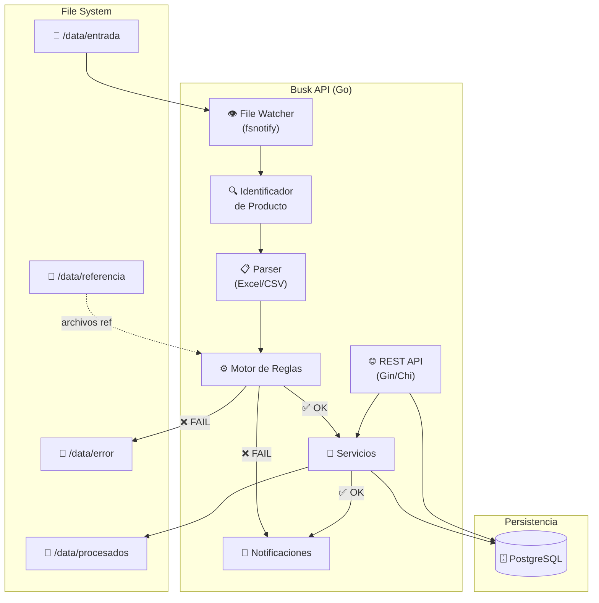
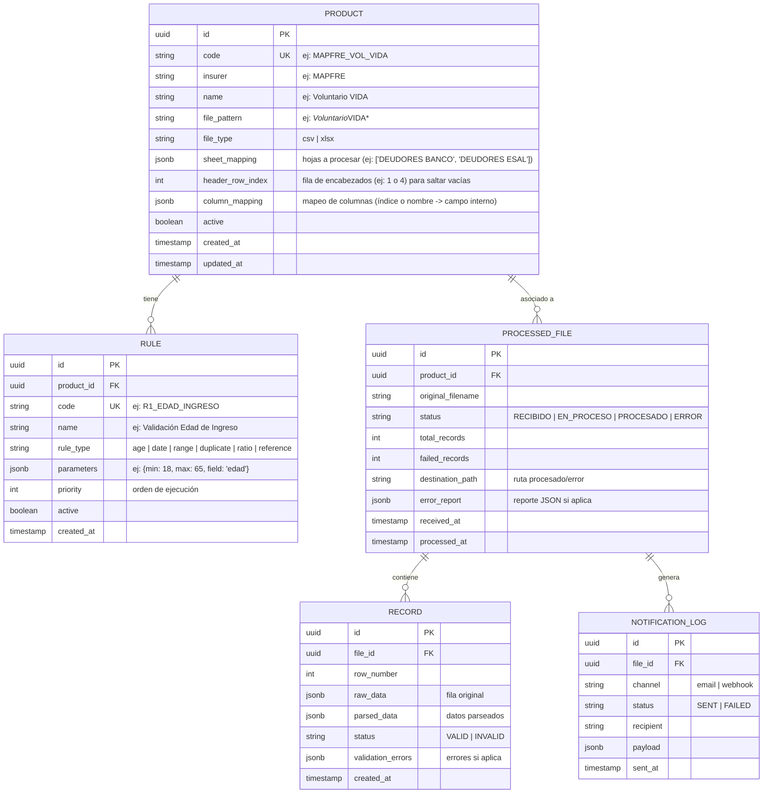
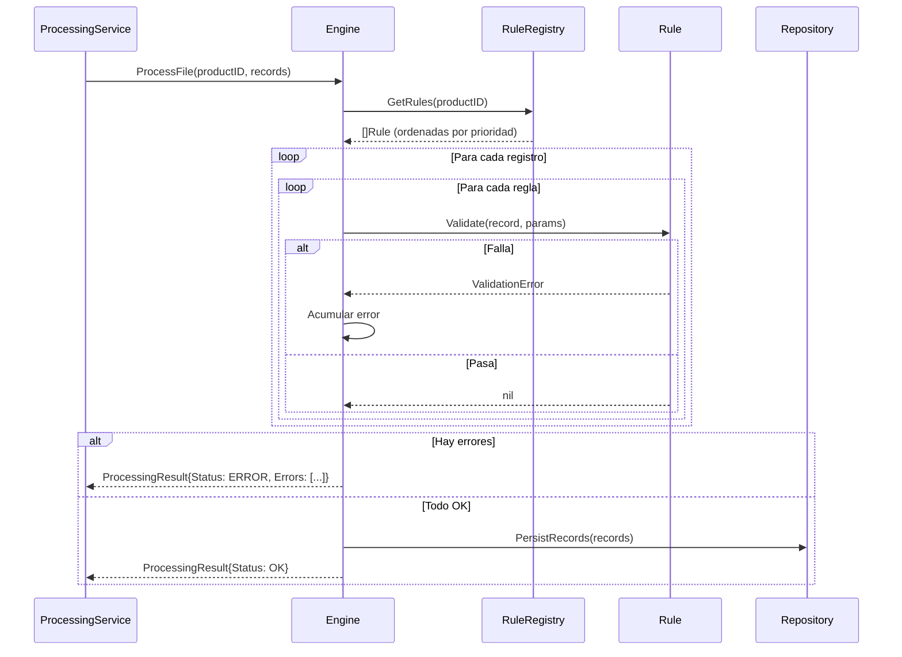
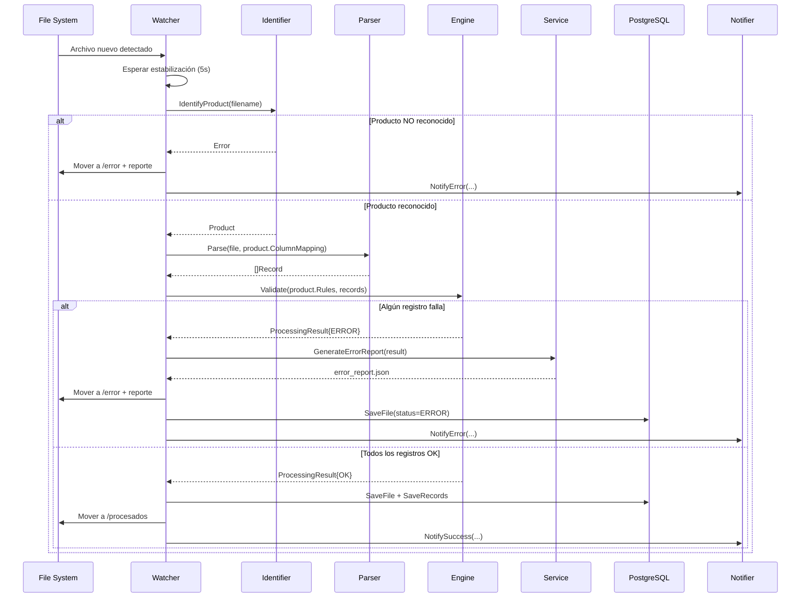

# Busk Seguros — Diseño Técnico: API de Procesamiento de Documentos

> **Versión:** 1.0  
> **Fecha:** 2026-03-11  
> **Stack:** Go  
> **Prerequisito:** [Análisis de Proceso](./analisis-proceso.md)

---

## 1. Arquitectura General



---

## 2. Estructura del Proyecto (Go)

```
busk-api/
├── cmd/
│   └── server/
│       └── main.go                  # Entry point
│
├── internal/
│   ├── config/
│   │   └── config.go               # Configuración (env, YAML)
│   │
│   ├── domain/
│   │   ├── product.go              # Entidad Producto
│   │   ├── rule.go                 # Entidad Regla
│   │   ├── file_record.go          # Entidad Archivo + Registros
│   │   └── processing_result.go    # Resultado de procesamiento
│   │
│   ├── watcher/
│   │   └── watcher.go              # File watcher (fsnotify)
│   │
│   ├── identifier/
│   │   └── identifier.go           # Identificación de producto por nombre de archivo
│   │
│   ├── parser/
│   │   ├── parser.go               # Interface Parser
│   │   ├── csv_parser.go           # Implementación CSV
│   │   └── excel_parser.go         # Implementación Excel (excelize)
│   │
│   ├── engine/
│   │   ├── engine.go               # Motor de reglas principal
│   │   ├── rule_registry.go        # Registro de reglas disponibles
│   │   └── rules/
│   │       ├── age_rule.go          # R1, R2, R11 - Validación de edad
│   │       ├── plan_rule.go         # R3 - Plan válido
│   │       ├── date_rule.go         # R4, R5, R10 - Validaciones de fecha
│   │       ├── stock_rule.go        # R6 - Cruce con stock
│   │       ├── claims_rule.go       # R7 - Cruce con siniestros
│   │       ├── debt_ratio_rule.go   # R8 - Deuda vs Prima
│   │       ├── term_rule.go         # R9 - Validación de plazo
│   │       └── duplicate_rule.go    # R12 - Duplicados
│   │
│   ├── notifier/
│   │   ├── notifier.go             # Interface Notificador
│   │   ├── email_notifier.go       # Implementación Email
│   │   └── webhook_notifier.go     # Implementación Webhook
│   │
│   ├── repository/
│   │   ├── product_repo.go         # CRUD Productos
│   │   ├── rule_repo.go            # CRUD Reglas
│   │   ├── file_repo.go            # CRUD Archivos procesados
│   │   └── record_repo.go          # CRUD Registros
│   │
│   ├── service/
│   │   ├── processing_service.go   # Orquestador principal
│   │   ├── product_service.go      # Lógica de productos
│   │   └── report_service.go       # Generación de reportes de error
│   │
│   └── handler/
│       ├── product_handler.go      # Handlers REST productos
│       ├── file_handler.go         # Handlers REST archivos
│       ├── rule_handler.go         # Handlers REST reglas
│       └── processing_handler.go   # Handler procesamiento manual
│
├── migrations/
│   ├── 001_create_products.sql
│   ├── 002_create_rules.sql
│   ├── 003_create_files.sql
│   └── 004_create_records.sql
│
├── config/
│   └── config.yaml                 # Configuración por defecto
│
├── go.mod
├── go.sum
├── Dockerfile
└── docker-compose.yaml
```

---

## 3. Modelo de Datos



---

## 4. Motor de Reglas — Diseño Detallado

### 4.1 Interface de Regla

```go
// Rule define la interfaz que toda regla de validación debe implementar.
type Rule interface {
    // Name retorna el nombre legible de la regla.
    Name() string
    // Code retorna el código único de la regla (ej: R1_EDAD_INGRESO).
    Code() string
    // Validate ejecuta la validación sobre un registro.
    // Retorna nil si pasa, o un ValidationError con el detalle si falla.
    Validate(ctx context.Context, record map[string]interface{}, params RuleParams) *ValidationError
}

// RuleParams contiene los parámetros configurables de cada regla.
type RuleParams struct {
    Field     string                 `json:"field"`      // campo a validar
    Min       *float64               `json:"min"`        // valor mínimo (opcional)
    Max       *float64               `json:"max"`        // valor máximo (opcional)
    Reference string                 `json:"reference"`  // archivo/tabla de referencia
    Extra     map[string]interface{} `json:"extra"`      // parámetros adicionales
}

// ValidationError describe un error de validación.
type ValidationError struct {
    Row     int    `json:"fila"`
    Field   string `json:"campo"`
    Value   any    `json:"valor"`
    Rule    string `json:"regla"`
    Message string `json:"mensaje"`
}
```

### 4.2 Tipos de Reglas Soportadas

| Tipo | Código | Descripción | Parámetros |
|------|--------|-------------|------------|
| `age` | Validación de edad | Calcula edad desde fecha de nacimiento y valida contra rango | `field`, `min`, `max`, `date_format` |
| `date` | Validación de fechas | Valida coherencia entre dos fechas | `field`, `compare_field`, `operator` (before/after/equals) |
| `range` | Validación de rango | Valida que un valor numérico esté en rango | `field`, `min`, `max` |
| `ratio` | Validación de ratio | Valida proporción entre dos campos | `field`, `compare_field`, `min_ratio`, `max_ratio` |
| `duplicate` | Detección de duplicados | Verifica que el valor no exista ya en BD | `field`, `reference_table` |
| `reference` | Cruce con referencia | Verifica existencia en archivo/tabla de referencia | `field`, `reference`, `lookup_field` |
| `plan` | Plan válido | Verifica que el plan exista en catálogo | `field`, `catalog` |

### 4.3 Flujo del Motor



---

## 5. File Watcher — Diseño

```go
// WatcherConfig configura el watcher de archivos.
type WatcherConfig struct {
    InputDir      string        // /data/entrada
    ProcessedDir  string        // /data/procesados
    ErrorDir      string        // /data/error
    PollInterval  time.Duration // intervalo de polling (fallback)
    FileStableFor time.Duration // esperar N segundos sin cambios antes de procesar
}
```

**Comportamiento:**
1. Usa `fsnotify` para detectar archivos nuevos en `/data/entrada`
2. Espera `FileStableFor` (ej: 5s) para asegurarse de que el archivo terminó de copiarse
3. Delega al `ProcessingService` para identificar, parsear y validar
4. Mueve el archivo a `/data/procesados/{fecha}/` o `/data/error/{fecha}/` según resultado
5. En caso de error genera reporte JSON junto al archivo

---

## 6. Endpoints REST

### 6.1 Productos

| Método | Endpoint | Descripción |
|--------|----------|-------------|
| `GET` | `/api/v1/products` | Listar todos los productos |
| `GET` | `/api/v1/products/:id` | Obtener producto por ID |
| `POST` | `/api/v1/products` | Crear producto |
| `PUT` | `/api/v1/products/:id` | Actualizar producto |
| `DELETE` | `/api/v1/products/:id` | Desactivar producto |

### 6.2 Reglas

| Método | Endpoint | Descripción |
|--------|----------|-------------|
| `GET` | `/api/v1/products/:id/rules` | Listar reglas de un producto |
| `POST` | `/api/v1/products/:id/rules` | Agregar regla a producto |
| `PUT` | `/api/v1/rules/:id` | Actualizar regla |
| `DELETE` | `/api/v1/rules/:id` | Desactivar regla |
| `GET` | `/api/v1/rules/types` | Listar tipos de reglas disponibles |

### 6.3 Archivos Procesados

| Método | Endpoint | Descripción |
|--------|----------|-------------|
| `GET` | `/api/v1/files` | Listar archivos (filtros: fecha, producto, estado) |
| `GET` | `/api/v1/files/:id` | Detalle de archivo |
| `GET` | `/api/v1/files/:id/records` | Registros de un archivo |
| `GET` | `/api/v1/files/:id/errors` | Reporte de errores |

### 6.4 Operaciones

| Método | Endpoint | Descripción |
|--------|----------|-------------|
| `POST` | `/api/v1/process/trigger` | Disparar procesamiento manual |
| `GET` | `/api/v1/process/status` | Estado del watcher y cola |

### 6.5 Dashboard / Métricas

| Método | Endpoint | Descripción |
|--------|----------|-------------|
| `GET` | `/api/v1/dashboard/summary` | Resumen: archivos hoy, exitosos, fallidos |
| `GET` | `/api/v1/dashboard/stats` | Estadísticas por producto y período |

---

## 7. Configuración (`config.yaml`)

```yaml
server:
  port: 8080
  mode: release  # debug | release

database:
  host: localhost
  port: 5432
  name: busk_seguros
  user: busk
  password: ${DB_PASSWORD}
  ssl_mode: disable

watcher:
  input_dir: /data/entrada
  processed_dir: /data/procesados
  error_dir: /data/error
  reference_dir: /data/referencia
  poll_interval: 10s
  file_stable_for: 5s
  enabled: true

notifications:
  email:
    enabled: true
    smtp_host: smtp.example.com
    smtp_port: 587
    from: noreply@buskseguros.com
    to:
      - operaciones@buskseguros.com
  webhook:
    enabled: false
    url: https://hooks.example.com/busk

logging:
  level: info
  format: json
```

---

## 8. Dependencias Go Principales y Rendimiento

Debido al gran volumen de datos (archivos con más de 120 columnas y potencialmente miles de filas), **es mandatorio procesar los archivos en streaming**.
- Para CSV: Se usará `csv.Reader` leyendo registro a registro.
- Para Excel: Se usará `excelize` leyendo fila a fila con el método `f.Rows(sheet)` y `rows.Next()`, evitando cargar todo el archivo a la memoria.

| Paquete | Uso |
|---------|-----|
| `github.com/gin-gonic/gin` | Framework HTTP REST |
| `github.com/fsnotify/fsnotify` | File system watcher |
| `github.com/xuri/excelize/v2` | Lectura Excel (.xlsx) en streaming |
| `encoding/csv` (stdlib) | Lectura de archivos CSV en streaming |
| `gorm.io/gorm` | ORM para PostgreSQL |
| `gorm.io/driver/postgres` | Driver PostgreSQL |
| `github.com/google/uuid` | Generación de UUIDs |
| `github.com/spf13/viper` | Gestión de configuración |
| `go.uber.org/zap` | Logging estructurado |
| `github.com/golang-migrate/migrate` | Migraciones SQL |

---

## 9. Docker Compose

```yaml
version: '3.8'
services:
  api:
    build: .
    ports:
      - "8080:8080"
    volumes:
      - ./data:/data
    environment:
      - DB_PASSWORD=secret
    depends_on:
      - db

  db:
    image: postgres:16-alpine
    environment:
      POSTGRES_DB: busk_seguros
      POSTGRES_USER: busk
      POSTGRES_PASSWORD: secret
    ports:
      - "5432:5432"
    volumes:
      - pgdata:/var/lib/postgresql/data

volumes:
  pgdata:
```

---

## 10. Secuencia Completa de Procesamiento



---

## 11. Ejemplo de Configuración de Regla en BD

```json
{
  "id": "550e8400-e29b-41d4-a716-446655440001",
  "product_id": "550e8400-e29b-41d4-a716-446655440010",
  "code": "R11_EDAD_DEUDOR",
  "name": "Validación de Edad del Deudor",
  "rule_type": "age",
  "parameters": {
    "field": "FECHA_NACIMIENTO",
    "date_format": "2006-01-02",
    "min": 18,
    "max": 65
  },
  "priority": 1,
  "active": true
}
```

**Cómo funciona:** El motor lee esta configuración, instancia la regla `age`, le pasa los `parameters`, y la regla calcula la edad del registro comparando `FECHA_NACIMIENTO` contra la fecha actual. Si la edad resultante está fuera del rango [18, 65], genera un `ValidationError`.

---

## 12. Próximos Pasos

1. ✅ Análisis de proceso
2. ✅ Diseño técnico — **este documento**
3. ⬜ Implementación — comenzar por dominio, motor de reglas, watcher, y API
4. ⬜ Pruebas con archivos de ejemplo
